# Certification-Hub
This repository is a simple record of some certificates and badges I’ve earned while learning. It’s not everything I know, but it’s a way to keep track of my progress and stay motivated to keep improving.

###  Courses & Professional Tracks :

◆ Professional Certificate — Google UX Design  
◆ Professional Certificate — Google Cybersecurity  
◆ Introduction to Cybersecurity — Cisco (2025)  
◆ JavaScript Essentials 1 — Cisco (2025)  
◆ Getting Started with Cisco Packet Tracer — Cisco (2025)  
◆ GEMINI Certified Student (2025)  
◆ Computer Hardware Basics — Cisco (2026)

###  TryHackMe Paths 

◆ Cybersecurity 101 (2026)  
◆ Pre-Security (2025)  
◆ Advent of Cyber — 24 Cybersecurity Challenges (2025)  
◆ Industrial Intrusion CTF (2025)

###  TryHackMe Badge Wall

  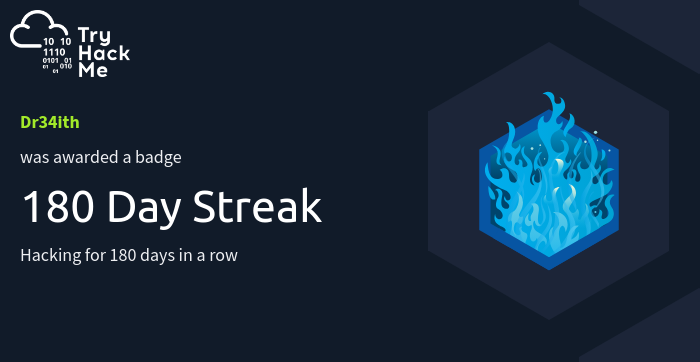
  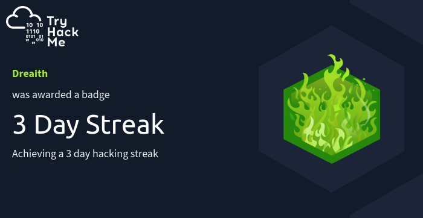
  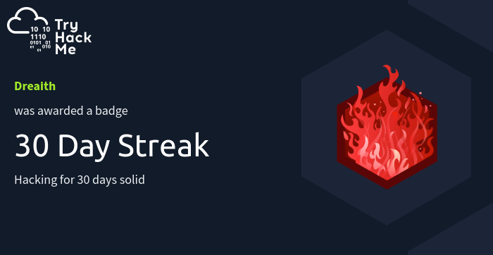
  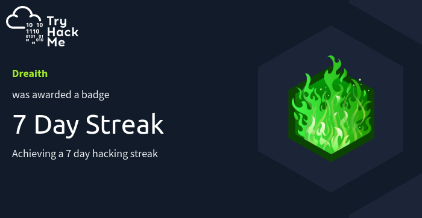
  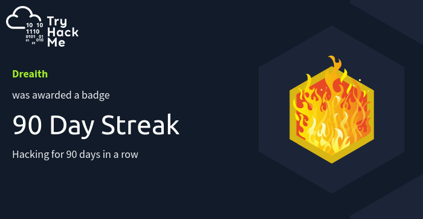
  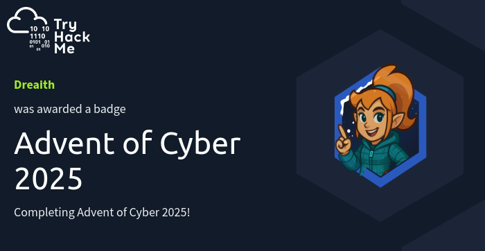

  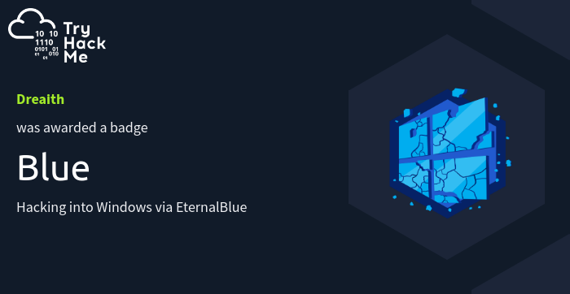
  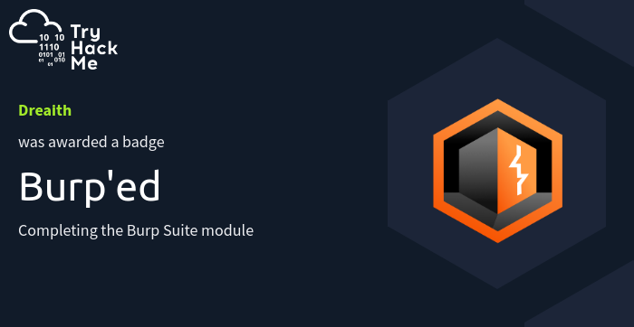
  
  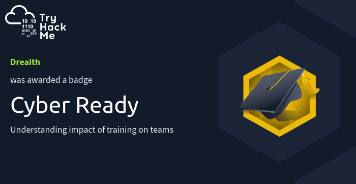
  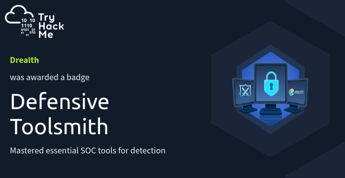
  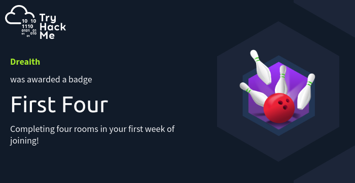

  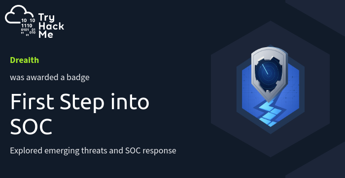
  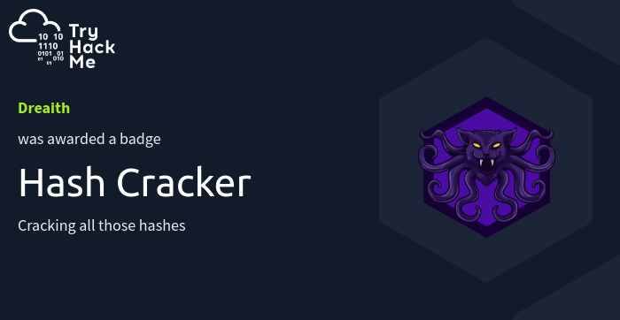
  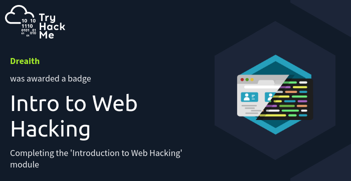
  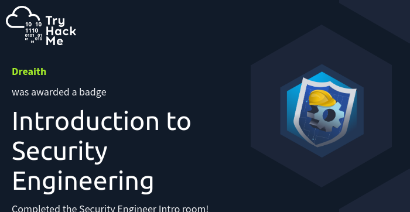
  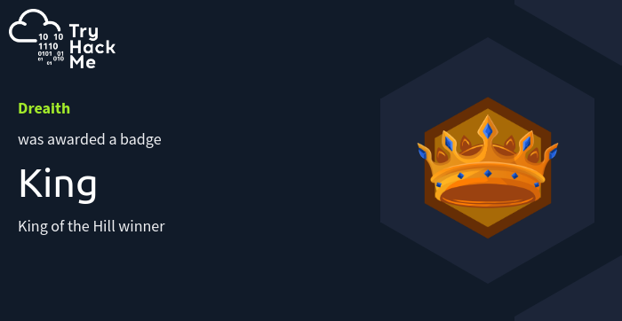
  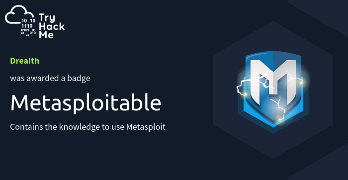

  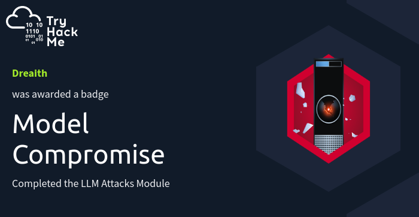
  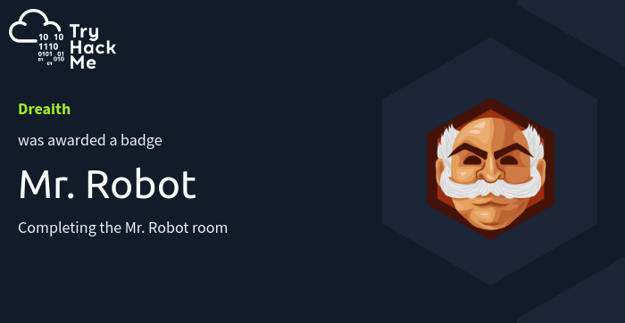
  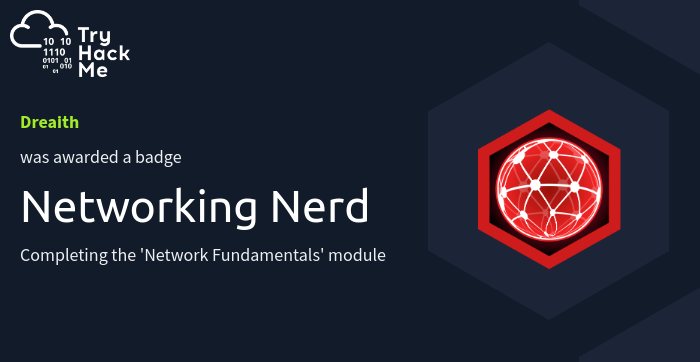
  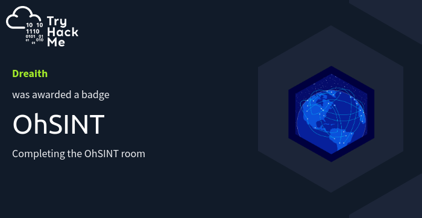
  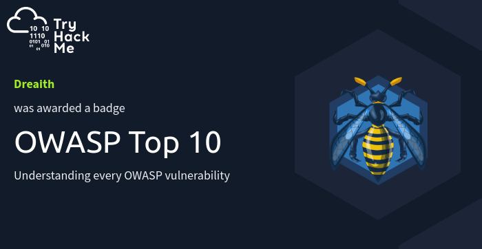
  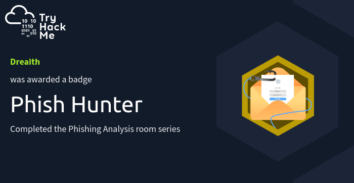

  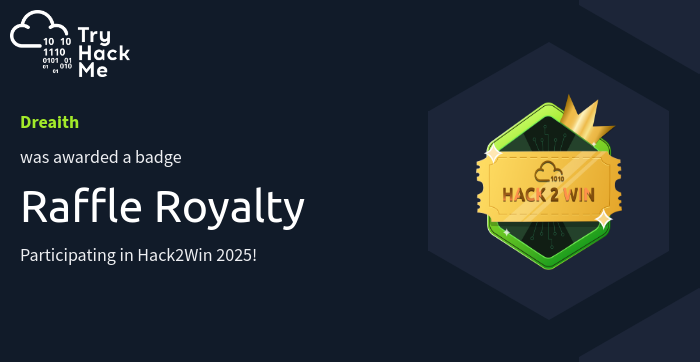
  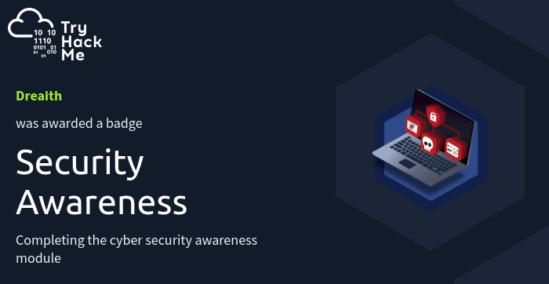
  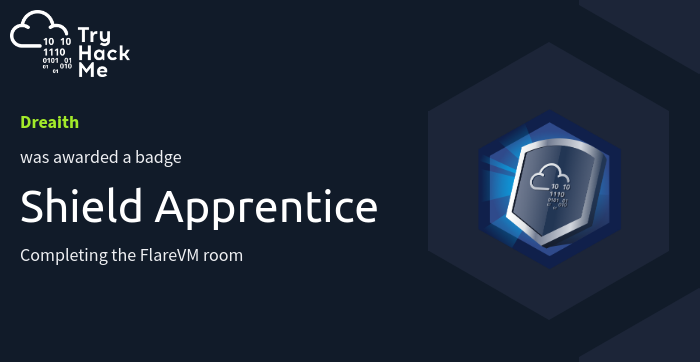
  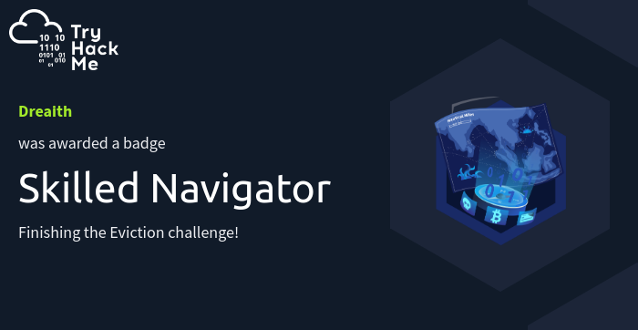
  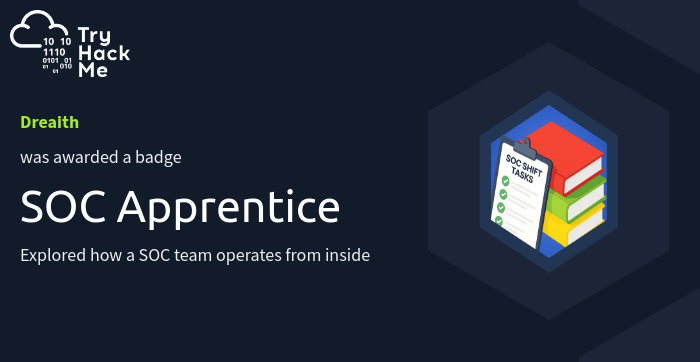
  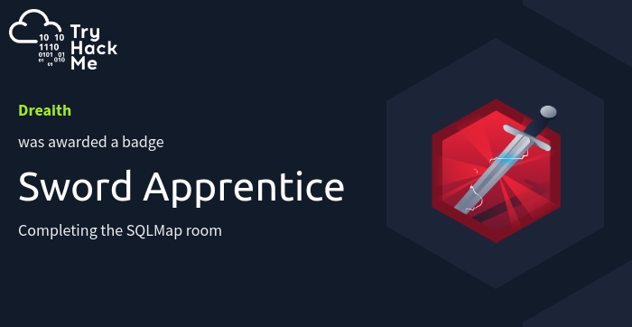

  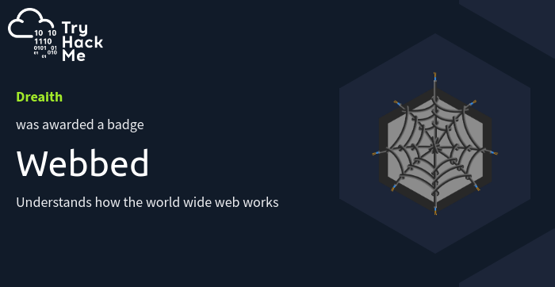
  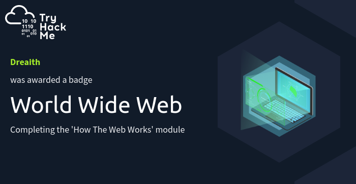

##  Seminars & Community Learning

◆ Canva Natin To: The 5th Canva Webinar Workshop Series (2023)  
◆ Roles in Cybersecurity — University Seminar (2025)  
◆ Web Development — University Seminar (2025)  
◆ Life After Graduation — University Seminar (2025)  
◆ Business Communication — University Seminar (2025)  
◆ How to Build a Creative Portfolio — University Seminar (2025)  
◆ SQL Backend — University Seminar (2025)  
◆ HTB Online Meetup: *Is your Cloud S3cure? Hardening AWS through Security Testing Tactics* (2025)  
◆ Inside the Blue Team — Community Talk (2025)

