

# 🏛️ Certification Hub

A collection of professional certifications and specialized training tracks documenting my technical evolution in Cybersecurity and Design.

---

##  Professional Certifications & Tracks

| Credential | Issuer | Year |
| :---: | :---: | :---: |
| **Google Cybersecurity Professional Certificate** | Google | 2025 |
| **Google UX Design Professional Certificate** | Google | 2025 |
| **CDTH — Cyber Defense & Threat Hunting Completion** | - | 2026 |
| **Introduction to Cybersecurity** | Cisco | 2025 |
| **JavaScript Essentials 1** | Cisco | 2025 |
| **Getting Started with Cisco Packet Tracer** | Cisco | 2025 |
| **Computer Hardware Basics** | Cisco | 2026 |
| **GEMINI Certified Student** | Google | 2025 |

 

##  TryHackMe Offensive & Defensive Paths

| Specialized Path / CTF | Status | Year |
| :---: | :---: | :---: |
| **Jr. Penetration Tester** | Completed | 2026 |
| **Web Fundamentals** | Completed | 2026 |
| **Cybersecurity 101** | Completed | 2026 |
| **Advent of Cyber** | Completed | 2025 |
| **Industrial Intrusion CTF** | Captured | 2025 |
| **Pre-Security** | Completed | 2025 |

<h2 align="center"> Badges </h2>

  
  
  
  
  

 

<h3 align="center"> TryHackMe Badge Wall</h3>

  <a href="https://tryhackme.com/p/YOUR_USERNAME">
    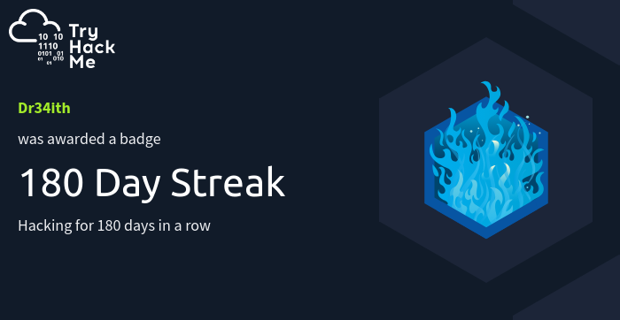
    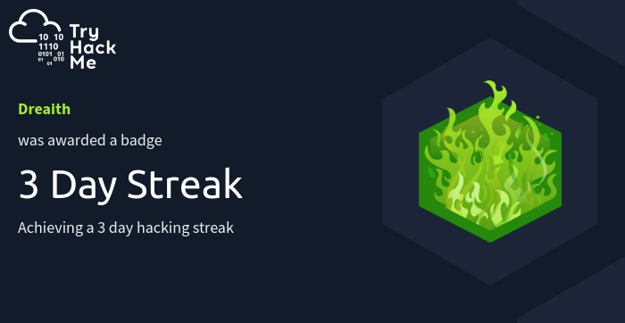
    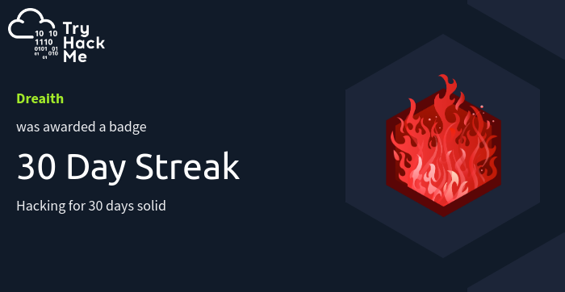
    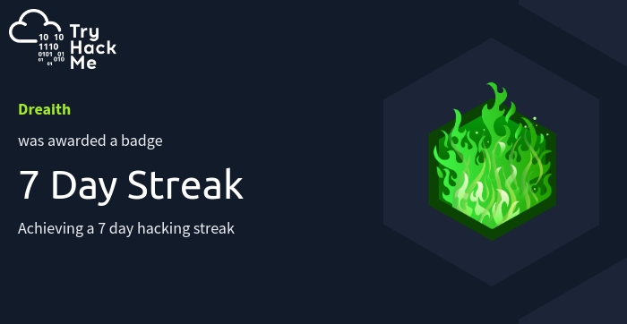
    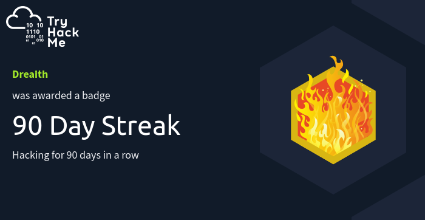
    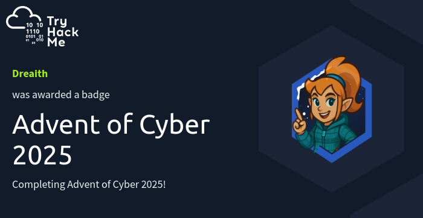
    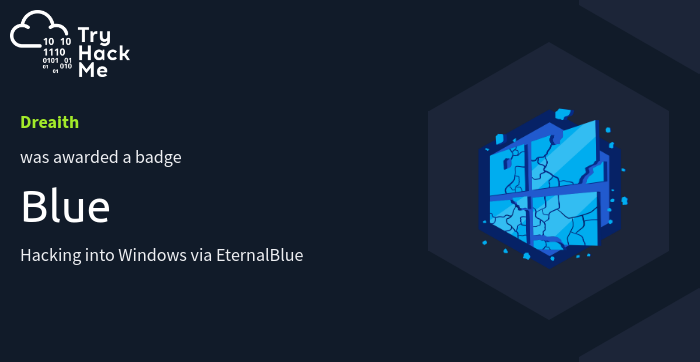
    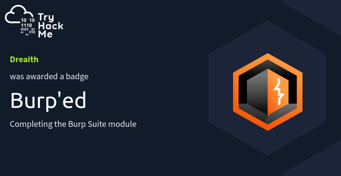
    
    
    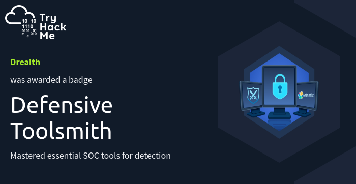
    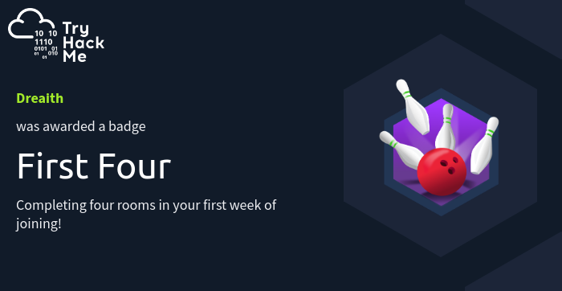
    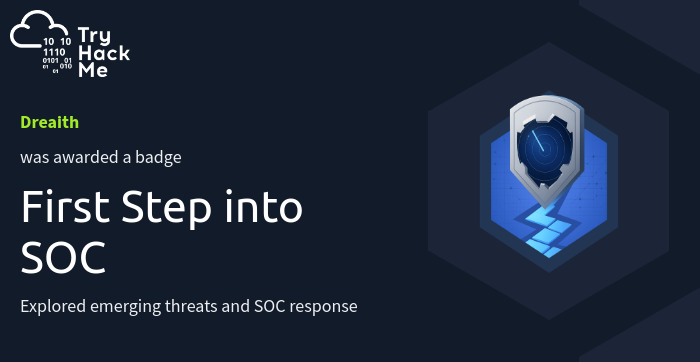
    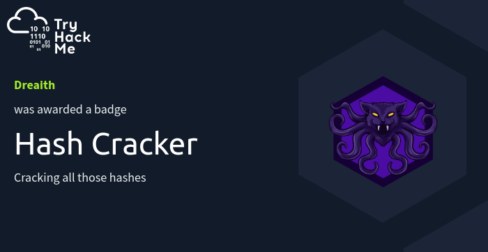
    
    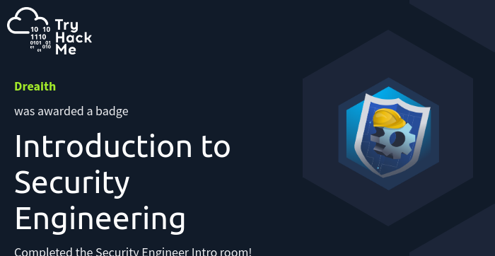
    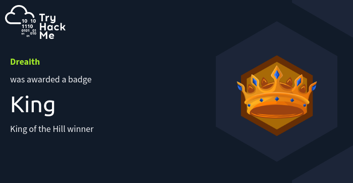
    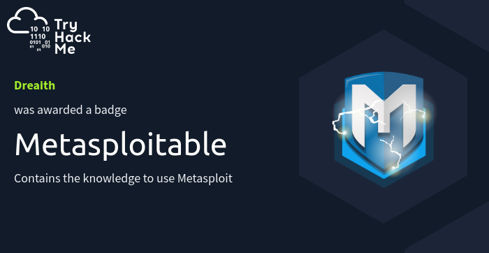
    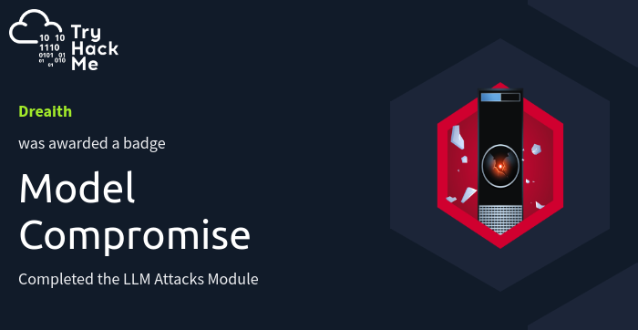
    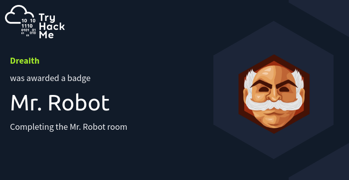
    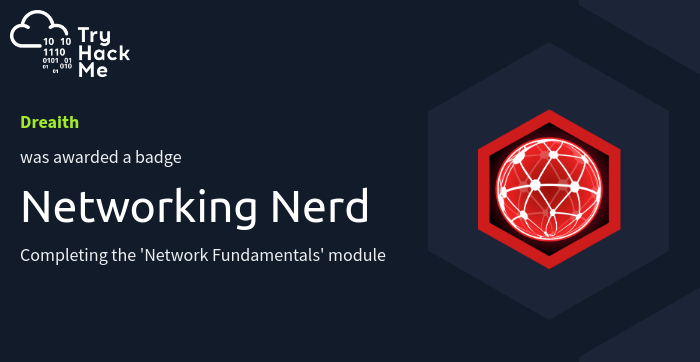
    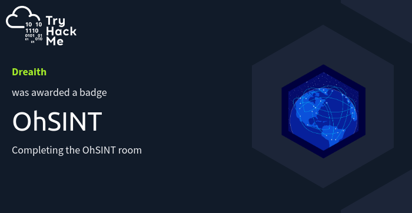
    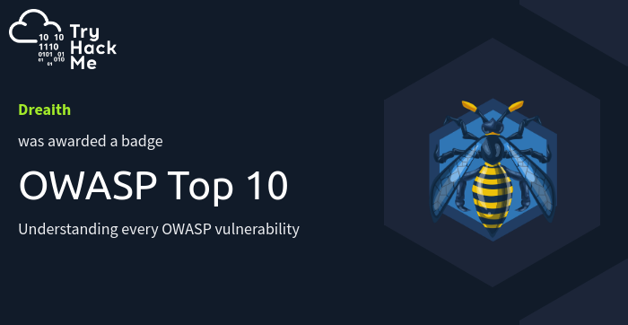
    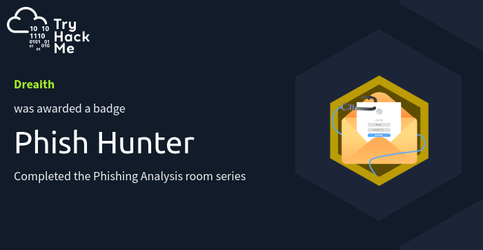
    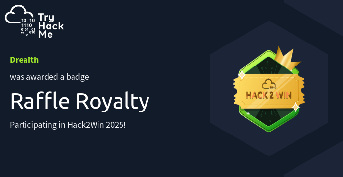
    
    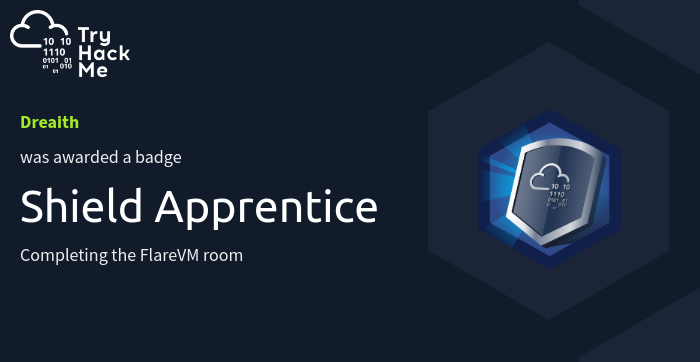
    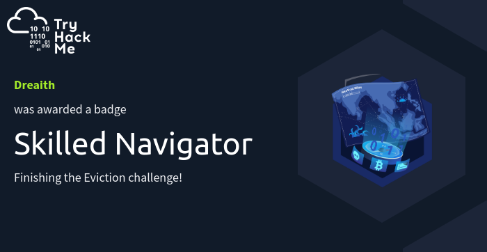
    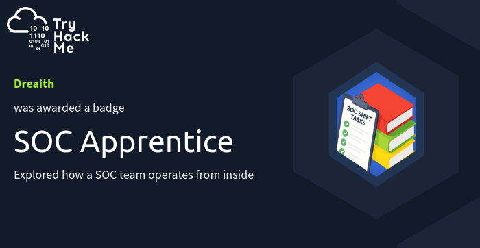
    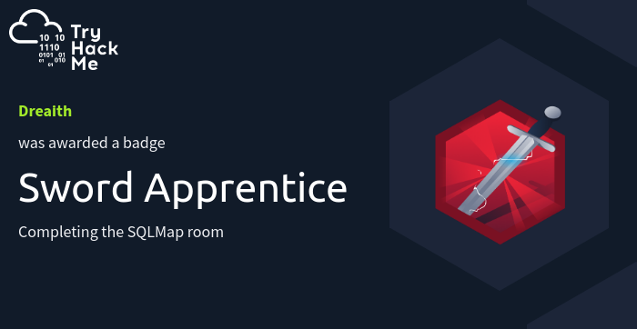
    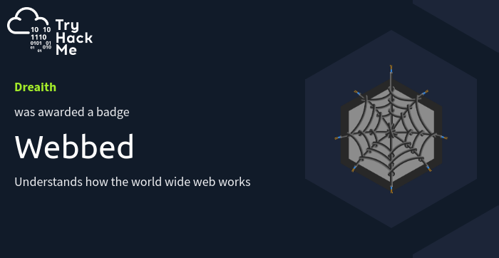
    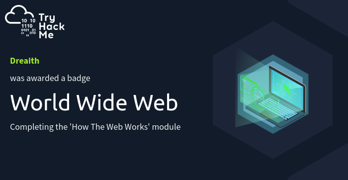
  </a>

  

##  Continuous Learning & Seminars

###  Cybersecurity & Defense
* **HTB Online Meetup:** *Is your Cloud S3cure? Hardening AWS through Security Testing Tactics* (2025)
* **Inside the Blue Team:** Community Talk (2025)
* **Roles in Cybersecurity:** University Seminar (2025)

###  Development & Data
* **SQL Backend:** University Seminar (2025)
* **Web Development:** University Seminar (2025)
* **Canva Natin To:** 5th Canva Webinar Workshop Series (2023)

###  Professional Development
* **How to Build a Creative Portfolio:** University Seminar (2025)
* **Business Communication:** University Seminar (2025)
* **Life After Graduation:** University Seminar (2025)
